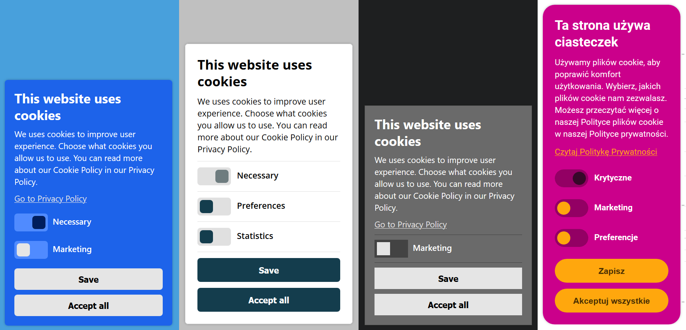

<p align="center">
	<a href="https://www.privacyrun.com/"></a>
</p>

# Privacy RUN - Cookie Consent

[](https://travis-ci.org/PrivacyRUN/cookie-consent) [](/LICENSE) [](https://coveralls.io/github/PrivacyRUN/cookie-consent?branch=master)

[Privacy RUN](https://www.privacyrun.com/) (Ready to Use Now). Easy to install and configure cookie consent banner. Cookie Consent can block scripts and iframes. It uses for that two methods, you can read about this [here](https://medium.com/snips-ai/how-to-block-third-party-scripts-with-a-few-lines-of-javascript-f0b08b9c4c0).

This project works in modern browsers (Firefox, Chrome, Edge...) and Internet Explorer 11 ([important](#internet-explorer-11)).



### How to Install?

Put the script **as the first script** in your webpage. We recommend putting the script into `<head>` section.

```html
...
<head>
<meta charset="UTF-8">
<script>
var _cookieConsent = {
   resources: [
      { category: 'necessary', type: 'script', url: /^.*query-3\.5\.1\.min\.js$/ },
      /* ... */
   ]
};
</script>
<script src="https://cdn.jsdelivr.net/npm/privacyrun.cookie-consent@0.1.0/cookieconsent.js"></script>
...
```

# Configuration

### Categorization

Cookie Consent blocks every external script and every iframe until a user gives a consent (with a small exception, check `neccessary` category). The user can give a partial consent for specific categories. **It is required to categorize EVERY script and EVERY iframe in your webpage**. Otherwise the banner will show `unclassified` category. To categorize resources, you must fill `resources` collection in the configuration.

```js
var _cookieConsent = {
   resources: [
      { category: 'necessary',   type: 'script', url: 'https://code.jquery.com/jquery-3.5.1.min.js' },
      { category: 'statistics',  type: 'script', url: 'https://www.google-analytics.com/analytics.js' },
      { category: 'statistics',  type: 'script', url: 'https://follow-user.com/follow.js' },
      { category: 'preferences', type: 'script', url: /^.*preferences.js$/ },
      { category: 'marketing',   type: 'iframe', url: /^.*ads.html$/ },
      /* ... */
   ]
};
```

Supported categories for `category` property:
- `necessary` - necessary for the website works properly, **this resource won't be blocked**,
- `statistics`
- `preferences`
- `marketing`

Supported resource types for `type` property:
- `script`
- `iframe`

Support URL formats for `url` property:
- `'http://example.com/script.js'` - absolute URL,
- `/^.*file.js$*/` - regular expression for absolute URL

### Internet Explorer 11

The script blocking does not work until we add `defer` attribute to the script tag. This happens only in Internet Explorer 11. Unluckily, this means, you should add that attribute to every script in your webpage. You should skip this for  `necessary` scripts.

```html
<script defer src="//example.com/foo.js"></script>
```

### Customization

You may need a some bunch of customization for your website. To do that you can set bellow properties.

```js
var _cookieConsent = {
   resources: [ /* ... */ ],
   privacyPolicyUrl: 'http://example.com/privacy-policy.html',
   theme: {
      borderSize: 1,
      spacing: 10,
      radius: 20,
      bannerWidth: 230,
      fontSize: 14,
      lineHeight: 20,
      headerFontSize: 22,
      headerLineHeight: 28,
      colors: [
         '#CB008B', // background color
         '#FFF', // text color
         '#FFA70D', // primary color
         '#4D3100', // primary text color
         '#FFC45D', // primary hover color
         '#360829', // primary disabled color
         '#930064', // secondary color
         '#B2007C', // secondary hover color
         '#363636' // secondary text color
      ]
   }
};
```

This project contains a few examples. Check [tests/testpages](tests/testpages) directory.

### Internationalization

The banner supports English language by default. If you want more languages you may add own language.

```js
var _cookieConsent = {
   resources: [ /* ... */ ],
   translations: {
      'pl': {
         bannerTitle: 'Ta strona używa ciasteczek',
         bannerDescription: 'Używamy plików cookie, aby poprawić komfort użytkowania. Wybierz, jakich plików cookie nam zezwalasz.',
         bannerOpenPrivacyPolicy: 'Czytaj Politykę Prywatności',
         save: 'Zapisz',
         acceptAll: 'Akceptuj wszystkie',
         necessary: 'Krytyczne',
         marketing: 'Marketing',
         preferences: 'Preferencje',
         statistics: 'Monitoring',
         unclassified: 'Nieznane'
      },
      // ...
   }
};
```

The banner tries guess user language from supported languages. But if you want to set specific language, you may do it by set `language` property.

```js
var _cookieConsent = {
   resources: [ /* ... */ ],
   translations: { /* ... */ },
   language: 'pl'
}
```

### Manager

The banner providers the manager to control consents and the banner.

#### Listen Events

```ts
window.cookieManager.listen(function (eventName) {
  // ...
});
``` 
Supported event names:

* `bannerOpened`
* `bannerClosed`
* `consentsChanged`
* `beforeUnblocking` - before unblocking resources,
* `beforeReloading` - before reloading the page (this happens when a user removes any consent and it's required to remove some resource).

#### Read Consents

```js
window.cookieManager.getConsents();
```

#### Open Banner to Edit Consents

```js
window.cookieManager.editGrantedConsents();
```

# Adapt Own Scripts

You may need to change some scripts on your page to work with the cookie banner. Your scripts could be run on the page in a different time now, if the user has accepted consents your script will run immediately, but if the user hasn't accepted consents your script will run after acceptation. This is the reason why you shouldn't rely on `onload` event.  The better solution is below.

```js
function ready() {
   // ...
}

if (document.readyState === 'complete') {
   ready();
} else {
   window.addEventListener('DOMContentLoaded', ready, false);
}
```

# License

This project is released under the MIT license.
